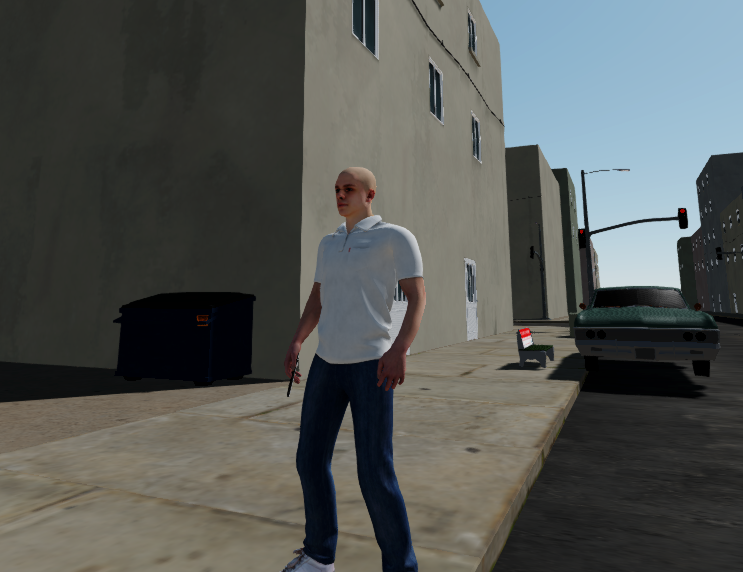

## GTA.js

### What's this?

Aims to be a copycat of GTA (more particularly GTA V) that runs on the browser.

### Main components

- Blender for 3D assets creation
- Three.js for 3D integration
- Cannon.js for physics
- Angular for UI

### Dependencies

- Node.js 16
- Angular 10
- Three.js 0.113.0

### Roadmap

https://trello.com/b/MEE1t6Nt/gta-copycat-project

### World

The 3D world's components are custom-made in Blender, and are thought to be as modular, optimized and instantiable as possible.

### Quick start

``npm install``

### Development

Run `ng serve` to run with the real world.

### Sandbox mode

Run `ng serve -c sandbox` to have a blank world where you can debug things.

### World's Blend files directory

All world files can be found in GTA Copycat/blend/customs

### Build

Run `ng build` to build the project. The build artifacts will be stored in the `dist/` directory. Use the `--prod` flag for a production build.

### Tests

Run `ng test` to execute the unit tests via [Karma](https://karma-runner.github.io).
